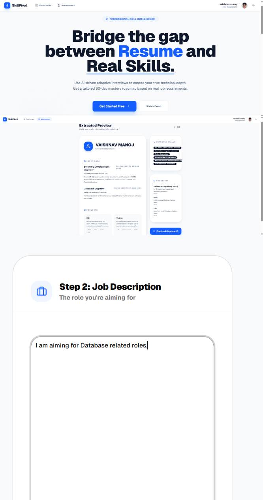
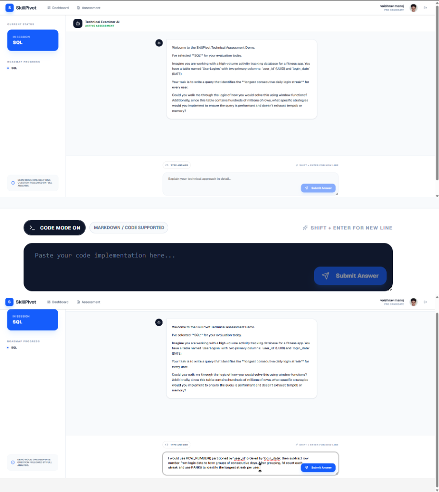
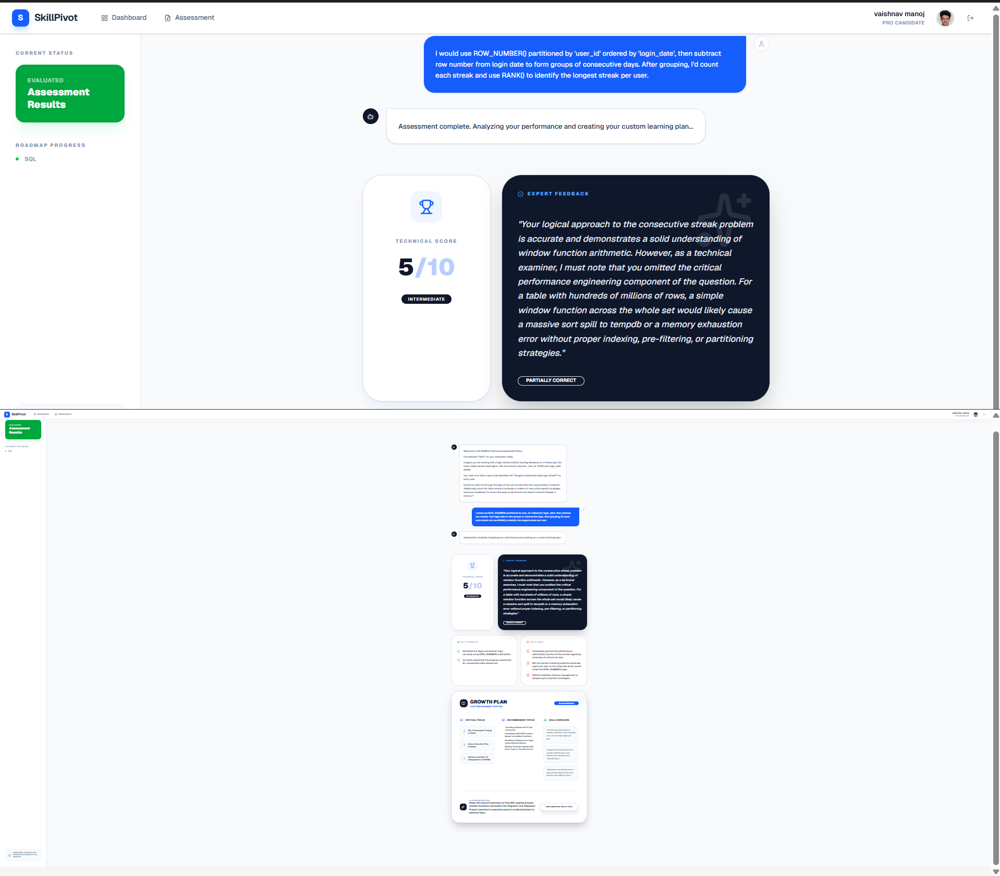

# SkillPivot Assessment AI

## 🔗 Project Link
https://ai.studio/apps/304b1e37-adb5-4ea2-b414-a268afc6ee85?fullscreenApplet=true

## 🚀 Overview
This project is an AI-powered SQL assessment system built using Google AI Studio. It demonstrates prompt engineering, sessionization logic, UI improvements, and debugging strategies.

## 🧠 Features
- SQL sessionization using window functions
- Prompt optimization to avoid AI timeouts
- Debugging "Assessment Engine failed to start"
- UI alignment fixes using Flexbox

## 🛠️ Tech Stack
- Google AI Studio
- SQL (PostgreSQL concepts)
- Prompt Engineering
- CSS (Flexbox)

## 📌 Key Concepts
- Gaps and Islands (SQL)
- Window Functions (LAG, SUM)
- AI Prompt Optimization
- UI/UX Improvements

## 📸 Screenshots

## 👤 Author
GitHub: https://github.com/VM-Coder-debug
